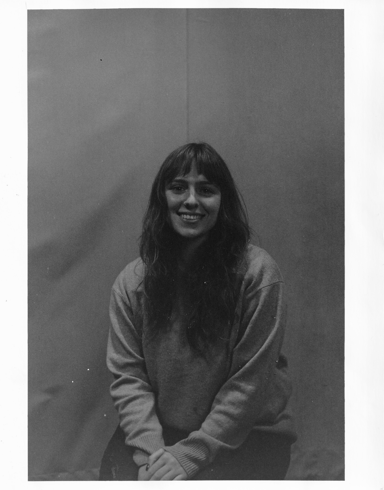

<body>

        

        

                

                
 Let me introduce myself!

                I recently graduated from Barnard College with a B.A. in <b>Computer Science</b>, accompanied by a minor in 
                English Literature. I am passionate about how society can use <b>tech for good</b>, and am currently searching for jobs that
                I believe would help me make a positive impact. 
                  At Barnard I was able to take a very diverse course load, ranging from Building Usable Security where I 
                worked with a team to create an <b> iOS app to help people store documents </b>  to 
                Computational Sound where I learned the art of<b>  live coding music, using Sonic Pi.</b> Of course, I also honed my skills in  
                languages such as <b> Python, C, Java, HTML, R</b>, etc. 
                  Last summer I gained valuable experience, interning at the Statue of Liberty-Ellis Island Foundation where I
                served as a <b>Software Development Intern</b>. I gained experience managing tickets in <b>Jira</b>, creating <b>clear documentation</b>, and writing <b>SQL queries </b>to access important information. 
                Most significantly, I worked on a <b>SalesForce migration</b>, conducting important testing. 
                  During my time in college, I also gained experience working for both 
               <b>WKCR and WBAR </b> . I love to connect with people, and I believe music is the perfect way to do that.
            
 

            

                

                    
                

            

        

    

</body>

