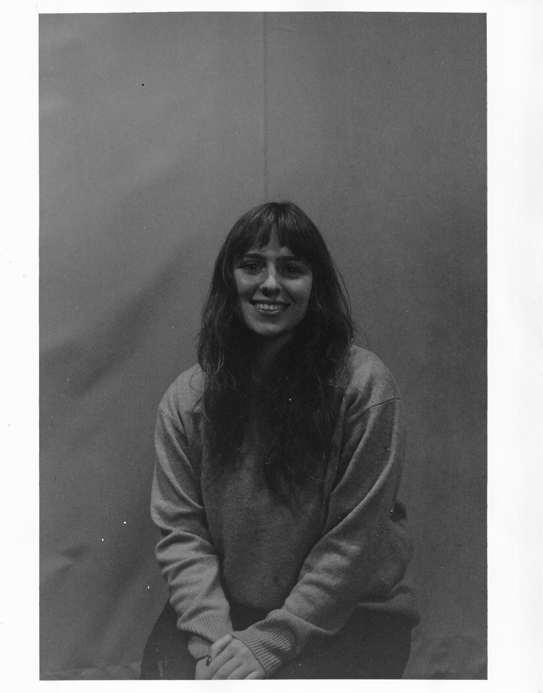
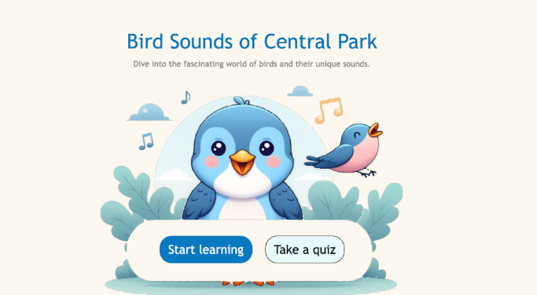

<body>
<header>
    <ul>
        <li class = "name"> <a>  Fiona Gaugush </a> </li>
        <li>
            
        </li>
        <li>    
        </li>
</ul>
</header>

    

        Hello, I'm Fiona!
    

    

        

        

                

                    I recently graduated from Barnard College with a B.A. in Computer Science and a minor in English Literature. I have a wide range of experience including sofware development, education, and radio. I am very interested in the intersection of art, education, and tech. I am extremely proficent in Python, Java, SQL, C, Swift, and HTML. Check out my projects to learn more!
                

            

            

                

                    
                

            

        

    

    

        

            

                My   Projects
            

        

        

            

                

                    <!-- Indicators -->
                    <ol class="carousel-indicators">
                        <li data-target="#myCarousel" data-slide-to="0" class="active"></li>
                        <li data-target="#myCarousel" data-slide-to="1"></li>
                        <li data-target="#myCarousel" data-slide-to="2"></li>
                    </ol>
                    

                        <!-- Slide 1 -->
                        

                            
                            

                                <h3 color = "white">FileSafe</h3>
                                
Safe storage of encrypted documents. An iOS app made with Swift and Firebase. Created for COMS3997.

                                <b>
                                    
 For more information, check out our design document <a href = https://docs.google.com/document/d/1fDti2-6BAYaTBDuyXUKpx1w3ME1SH7w0dc8VTikJsKY/edit?usp=sharing> here </a> 

                                </b>
                                
 Link to Github (contact for access)  <a href = https://github.com/Aristotle2003/TravelSafe> here </a>

                            

                        

                        

                            
                            

                                <h3 class = "white">Paws and Peril</h3>
                                
A fun fighting and exploring game made with Godot! Collaborators: Melina Garza and Samara Mohan

                                
 Download the ZIP and run on Godot <a href = https://github.com/fionagaugush/VideoGameFinal> here! </a>

                            

                        

                        

                            
                            

                                <h3 class = "white">Bird Sounds of Central Park</h3>
                                
An online page to help you learn the different calls of birds that can be found in Central Park. This was a final project for COMS4170 at Columbia University. Collaborators: Jyothi Gandi and Angel Sanchez Octotlan

                                
 View  <a href = https://github.com/fionagaugush/UIDesignFinal> here </a>

                            

                        

                    

                    <a class="left carousel-control" href="#myCarousel" data-slide="prev">
                        
                        Previous
                    </a>
                    <a class="right carousel-control" href="#myCarousel" data-slide="next">
                        
                        Next
                    </a>
                

            

        

    

</body>

